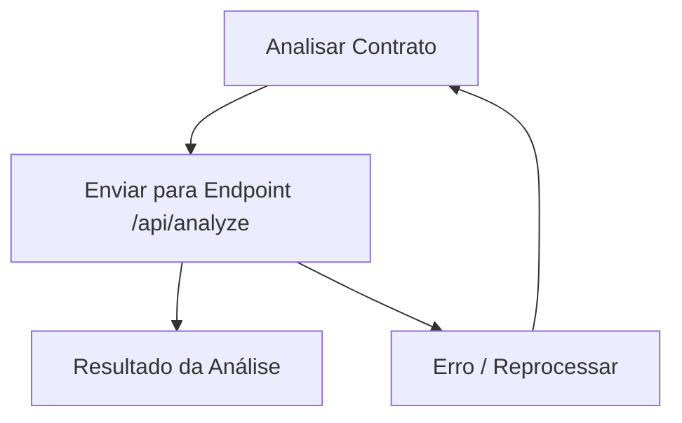

## 1. Product Overview
ContractAI é um web app para analisar contratos a partir do texto enviado na interface.
Ele retorna um diagnóstico estruturado (resumo, riscos e cláusulas) para apoiar revisão rápida.

## 2. Core Features

### 2.1 Feature Module
O ContractAI consiste nas seguintes páginas principais:
1. **Analisar Contrato**: entrada de texto/arquivo, execução da análise, exibição do resultado estruturado.

### 2.3 Page Details
| Page Name | Module Name | Feature description |
|-----------|-------------|---------------------|
| Analisar Contrato | Entrada do contrato | Inserir texto do contrato (colar) e/ou anexar arquivo para extração de texto. |
| Analisar Contrato | Disparo de análise | Enviar o conteúdo para o endpoint de análise e exibir estado de carregamento e falhas. |
| Analisar Contrato | Resultado da análise | Renderizar o JSON retornado em seções legíveis (resumo, riscos, cláusulas, recomendações) mantendo fidelidade aos campos. |
| Analisar Contrato | Tratamento de erros | Exibir mensagem clara para validação (texto vazio), falha de rede e erro do servidor. |

## 3. Core Process
**Fluxo do usuário (único):**
1. Você abre a página “Analisar Contrato”.
2. Você cola o texto do contrato (ou anexa um arquivo para extrair o texto).
3. Você aciona “Analisar”.
4. Eu envio o texto para o endpoint de análise.
5. Você visualiza o resultado por seções (derivado do JSON de resposta) ou uma mensagem de erro.

