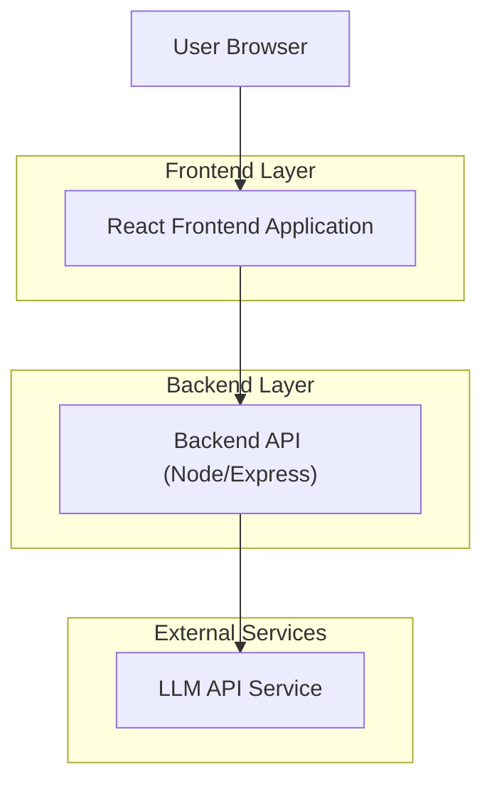
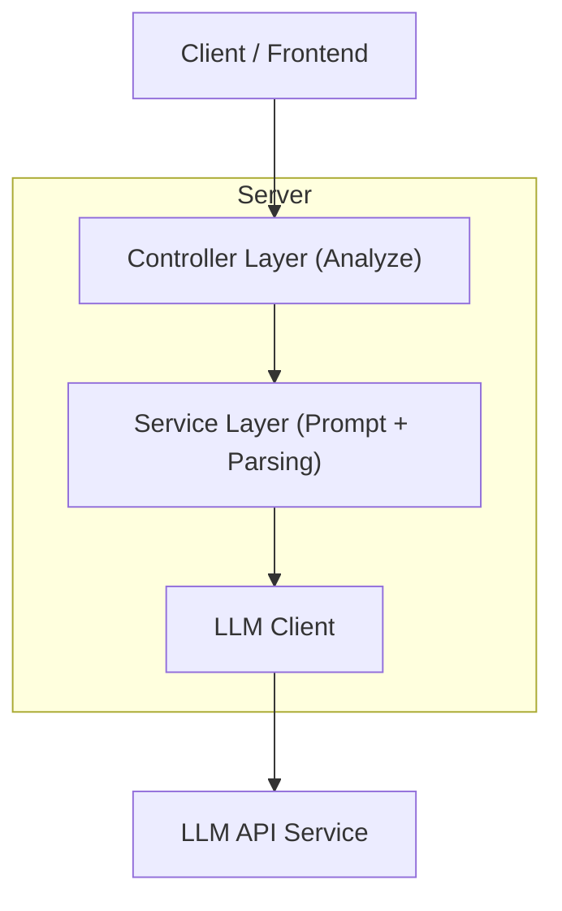

## 1.Architecture design



## 2.Technology Description

* Frontend: React\@18 + vite

* Backend: Node.js + Express\@4 (um único endpoint de análise)

## 3.Route definitions

| Route | Purpose                                                                                         |
| ----- | ----------------------------------------------------------------------------------------------- |
| /     | Página “Analisar Contrato”: entrada do texto/arquivo, disparo da análise, exibição do resultado |

## 4.API definitions (If it includes backend services)

### 4.1 Core API

Análise de contrato


Request:

| Param Name   | Param Type | isRequired | Description                                        |
| ------------ | ---------- | ---------- | -------------------------------------------------- |
| contractText | string     | true       | Texto completo do contrato em texto puro           |
| sourceName   | string     | false      | Nome do arquivo/origem (para exibição e auditoria) |
| locale       | string     | false      | Localidade do conteúdo (ex.: "pt-BR")              |

Response:

| Param Name | Param Type | Description                      |
| resumo     | string     | Resumo do contrato (até 5 linhas) |
| explicacao | string     | Explicação em linguagem simples |
| riscos     | string[]   | Até 5 riscos importantes |
| sugestoes  | string[]   | Até 5 sugestões práticas |
| score      | number     | Score de risco (0 a 100) |

Formato JSON de resposta:

```ts
  resumo: string;
  explicacao: string;
  riscos: string[];
  sugestoes: string[];
  score: number;
  };
};

Exemplo:

```json
  "resumo": "Contrato de prestação de serviços com prazo definido e condições de pagamento mensais.",
  "explicacao": "Em termos simples: você contrata um serviço, paga todo mês e há regras de cancelamento e multas.",
  "riscos": [
    "Multa alta em caso de rescisão antecipada.",
    "Regras de reajuste podem aumentar o custo ao longo do tempo."
  ],
  "sugestoes": [
    "Negocie multa proporcional ao período restante.",
    "Peça clareza sobre índice e periodicidade de reajuste."
  ],
  "score": 68
  }
}

## 5.Server architecture diagram (If it includes backend services)



## 6.Data model(if applicable)

Não aplicável (sem persistência obrigatória para a versão mínima).
